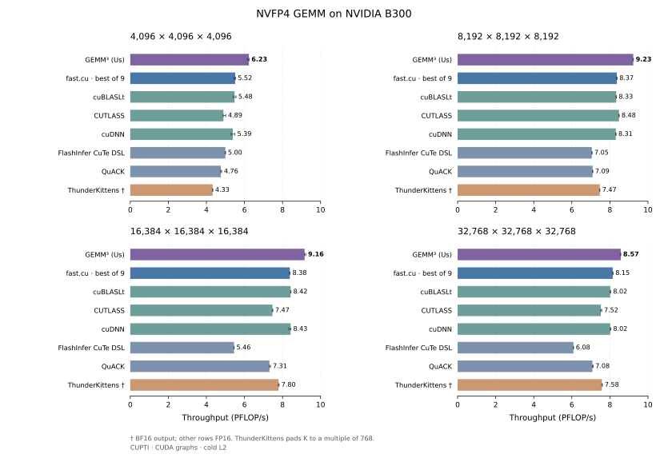

# GEMM³

**GEMM³** is fast NVFP4 matrix multiplication for **NVIDIA B300**, written in CuTe DSL. GB300 is also SM103 and supported, but unmeasured. It supports FP16 and BF16 output, with tuned presets for 4096³, 8192³, 16384³, and 32768³.

Python package: `nvfp4-gemm-cute`.

## Performance

**Up to 9.23 PFLOP/s** (8192³). The comparison covers fast.cu, cuBLASLt, CUTLASS and cuDNN (both through FlashInfer's backends), FlashInfer's CuTe DSL backend, QuACK, and ThunderKittens.



B300 · CUPTI 13.4 · CUDA graphs · cold L2 · eight rounds in rotated and reversed order. **† marks BF16 output**; other series use FP16. ThunderKittens pads K to a multiple of 768, and the padded work is timed. Quantization, allocation, padding, repacking, compilation, and autotuning are excluded.

| Shape | GEMM³ (µs) | fast.cu (µs) | Speedup |
|---|---:|---:|---:|
| 4096³ | 22.05 | 24.92 | 1.130× |
| 8192³ | 119.15 | 131.42 | 1.103× |
| 16384³ | 960.30 | 1049.10 | 1.092× |
| 32768³ | 8210.53 | 8633.83 | 1.052× |

fast.cu is not the fastest other implementation at every size: CUTLASS is faster at 8192³, and cuDNN and cuBLASLt are faster at 16384³. GEMM³ is fastest at all four sizes.

Measured with **cuBLAS 13.8, cuDNN 9.26 and CUDA 13.4**, using pinned source builds for open-source kernels. [All library timings and methodology →](docs/benchmarks.md) · [Source revisions and build instructions →](docs/benchmarks.md#versions-and-source)

## Optimizations

Every configuration builds upon the baseline targeting the SM103 architecture. All presets share a 256×256 math tile (spanning two CTAs) and the same core pipeline.

All presets share the following optimizations, which combine features from the [baseline](docs/kernel.md#flashinfer-pr-4866) with our [shared GEMM³ changes](docs/kernel.md#shared-changes):

- The baseline decouples memory operations (TMA A, B, and scale-factor loads) from math operations (`K=96` block-scaled MMA instructions). It uses overlapping TMEM accumulator views, phase-dependent epilogue traversal, and 256-bit vectorized global memory stores.

- The grid launch accepts both a preferred cluster shape and a 2×1 fallback. The persistent-slot budget comes from fallback capacity; shared memory per CTA is determined by the math tile and pipeline rings.

- The epilogue preloads both overlapping TMEM subtiles into registers and releases the accumulator pipeline before the first conversion and store. The baseline already released after the overlap reads, but converted and stored subtile 0 before reading subtile 1.

- Unused math instructions and shared-memory-to-TMEM scale copies are dynamically predicated in the final outer K iteration. Additionally, the kernel applies independent L2 cache eviction hints to operands and output traffic, favoring reused inputs over write-once outputs.

- The epilogue can insert a short timer-based pause between output subtiles (store pacing), and a single tile-coordinate decoder lets each preset choose its tile order (raster direction and cluster swizzle).

These mechanics are explained in [the shared GEMM³ changes](docs/kernel.md#shared-changes); each preset's steps are illustrated in [the shape-specific configurations](docs/kernel.md#shape-specific-presets).

### Per-shape changes

The table below details how CTA cluster geometry, instruction scheduling, and memory policies are tuned for different matrix dimensions.

| Problem shape | Cluster, scheduler, and compilation adjustments | Memory pipeline and cache adjustments | Latency reduction vs fast.cu | Documentation link |
| :--- | :--- | :--- | :--- | :--- |
| **4096³** | • Expands to a 4×2 cluster for matrix A multicast.<br>• Replaces M-fast raster order with a two-stripe N sweep to improve immediate data reuse. | • Issues explicit L2 memory prefetches *during* cluster setup to hide startup latency.<br>• Reduces the store-pacing interval for the short mainloop. | **2.87 µs** | [Steps and startup diagram →](docs/kernel.md#4096-startup-and-reuse) |
| **8192³** | • Expands to an 8×2 cluster.<br>• Uses a nine-slot ownership map for persistent clusters. | • Applies `evict_last` hints to matrix A and its scale factors, with a separate 48 MiB host L2 reservation. | **12.27 µs** | [Steps and ownership map →](docs/kernel.md#8192-ownership-and-cache-retention) |
| **16384³** | • Keeps the 8×2 cluster and four-stripe N sweep from the starting 16K configuration. | • Keeps the 40 MiB host L2 reservation.<br>• Trims unused TMA load slices and their handshakes in the final outer K iteration.<br>• Pre-computes shared-memory MMA descriptors before the data wait to hide arithmetic latency.<br>• Issues matrix B loads first and dynamically drops matrix A protection (`evict_first`) at the sweep end. | **88.80 µs** | [Steps and pipeline diagrams →](docs/kernel.md#16384-tail-and-instruction-issue) |
| **32768³** | • Reshapes the cluster to 4×4, narrowing the retained A band from 64 MiB to 32 MiB.<br>• Compiles with fixed 32768³ dimensions, `--opt-level 3` (the DSL default; other configurations use 2), and unrolls memory producer loops twice. | • Uses a 48 MiB host L2 reservation.<br>• Removes timer pacing from the existing paired 256-bit stores. | **423.30 µs** | [Steps and diagrams →](docs/kernel.md#32768-output-writeback) |

## Setup

Requires **Python 3.10+**, **CUDA 13**, a CUDA-enabled **PyTorch** installation, and an **SM103 GPU**. CUTLASS DSL ≥4.8 is installed as a dependency.

With GitHub CLI authenticated to an account that has repository access:

```bash
gh release download v0.1.0 --repo vincentzed/gemm3 --pattern '*.whl'
pip install "./nvfp4_gemm_cute-0.1.0-py3-none-any.whl[cu13]"
```

The `cu13` extra installs the CUDA 13 build of CUTLASS DSL.

For development:

```bash
gh repo clone vincentzed/gemm3
cd gemm3
pip install -e ".[cu13,bench,dev]"
```

## Getting started

Quantize the inputs, select the shape's preset, and call `gemm` inside its L2 reservation:

```python
import torch
from nvfp4_gemm_cute import config_for, gemm, persisting_l2, quantize_nvfp4

m = n = k = 8192
a = torch.randn(m, k, device="cuda")
b = torch.randn(n, k, device="cuda")  # B is [N, K], not [K, N]
a_q, a_sf, _ = quantize_nvfp4(a)
b_q, b_sf, _ = quantize_nvfp4(b)

cfg = config_for(m, n, k)
with persisting_l2(cfg.persist_mb):
    c = gemm(a_q, b_q, a_sf, b_sf, config=cfg)
# c: [M, N], FP16; computes dequant(A) @ dequant(B).T
```

Use `out_dtype=torch.bfloat16` for BF16 output. The first call compiles the kernel; later calls reuse it. N and K must be multiples of 64; M can be any size.

[Usage guide: packed inputs, scaling and buffer reuse →](docs/usage.md)

## Benchmarks and tests

From a development install:

```bash
python examples/demo.py 4096 4096 4096
python benchmarks/bench.py --shapes 4096,8192,16384,32768
pytest tests/
```

[Compare against fast.cu →](docs/benchmarks.md#reproduce) · [Recreate the figures →](docs/benchmarks.md#recreate-the-figures)

## Credits

Special thanks to **[Ash Xu (`ashxudev`)](https://github.com/ashxudev)** for [PR #4866](https://github.com/flashinfer-ai/flashinfer/pull/4866), whose changes we used as our base. Thanks also to **NVIDIA's CUTLASS contributors**, **`nv-yunzheq`** for the earlier [SM103 work in PR #2888](https://github.com/flashinfer-ai/flashinfer/pull/2888), **`Vinnie6167`** for the [shared alpha epilogues in PR #4526](https://github.com/flashinfer-ai/flashinfer/pull/4526), and the **FlashInfer contributors**.

[Pranjal Shankhdhar's fast.cu](https://github.com/pranjalssh/fast.cu) and [optimization walkthrough](https://cudaforfun.substack.com/p/outperforming-cublas-on-nvfp4) provide the main non-vendor comparison and useful companion reading.

[Apache-2.0](LICENSE). See [NOTICE](NOTICE).
