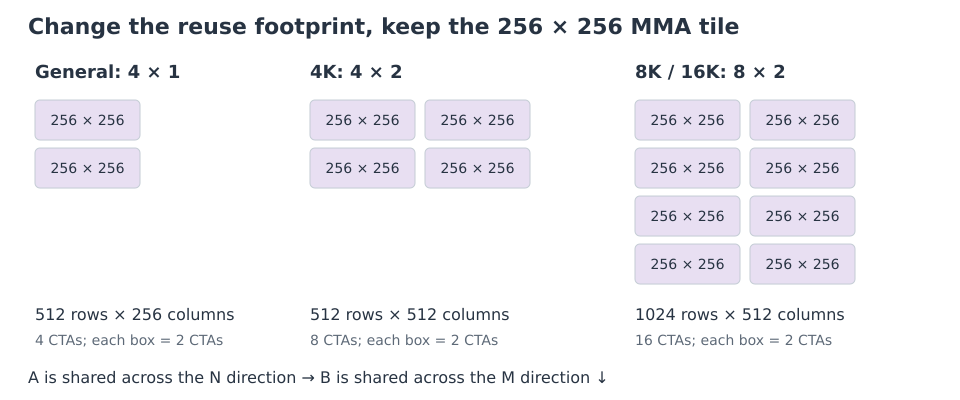
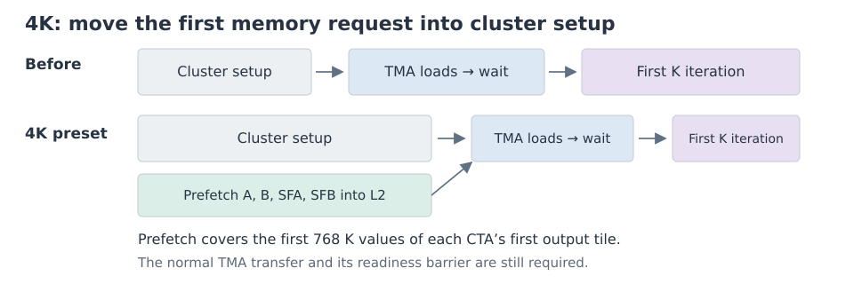
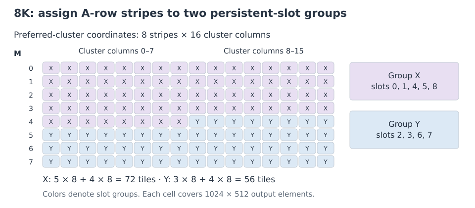
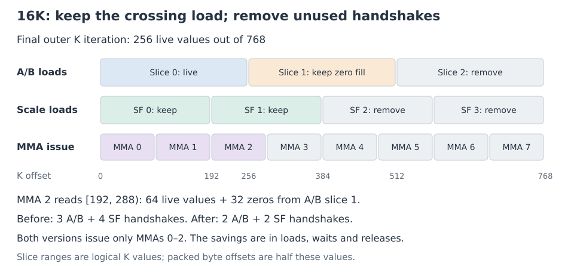
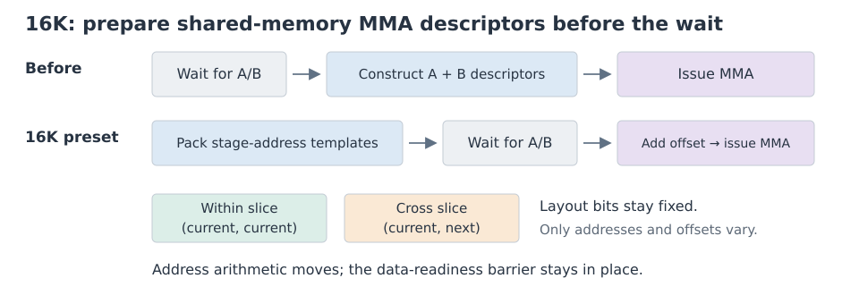
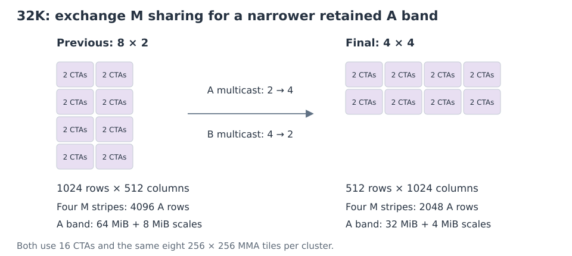
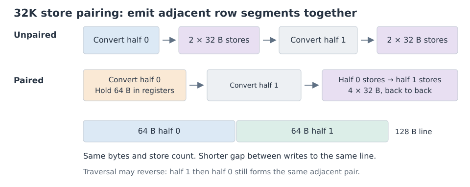

# Kernel design and optimizations

This guide traces the evolution of the kernel design through the following changes, explaining what was modified at each step and why:

- The foundational updates inherited from FlashInfer PR #4866.
- The shared GEMM³ modifications we applied afterward.
- The final shape-specific configurations and the reasoning behind their settings.

**Contents**

- [FlashInfer PR #4866](#flashinfer-pr-4866)
  - [Codebase lineage and upstream commits](#source-provenance)
- [Shared GEMM³ changes](#shared-changes)
- [Shape-specific configurations](#shape-specific-presets)
  - [Starting configuration](#starting-configuration)
  - [4K configuration (4096×4096×4096)](#4096-startup-and-reuse)
  - [8K configuration (8192×8192×8192)](#8192-ownership-and-cache-retention)
  - [16K configuration (16384×16384×16384)](#16384-tail-and-instruction-issue)
  - [32K configuration (32768×32768×32768)](#32768-output-writeback)
- [Measurements and source map](#measurements-and-source-map)
- [Summary of pipeline and architectural modifications](#changes-summary)
- [Retained baseline mechanisms](#retained-mechanisms)
- [Not in the final kernel](#removed-code)

## FlashInfer PR #4866

GEMM³ starts from the baseline in [FlashInfer PR #4866](https://github.com/flashinfer-ai/flashinfer/pull/4866). We owe many thanks to [Ash Xu (`ashxudev`)](https://github.com/ashxudev) for the base SM103 changes. This section explains what the baseline already did and how those mechanisms fit into the kernel.

We evaluate and build upon the source pinned exactly at commit **[`fd79d4e`](https://github.com/flashinfer-ai/flashinfer/commit/fd79d4e6b6b301d44073f17c9be3fa7758654933)** (see [Codebase lineage and upstream commits](#source-provenance) for file hashes).

For context, the complete development pipeline follows this progression:

**CUTLASS SM103 kernel** → **FlashInfer integration & alpha epilogues** → **Baseline from PR #4866** → **GEMM³ shared changes** → **Four shape-specific configurations**.

### What existed before this PR

Before PR #4866, several core components were already in place. The [CUTLASS SM103 example](https://github.com/NVIDIA/cutlass/blob/main/examples/python/CuTeDSL/blackwell/sm103_dense_blockscaled_gemm_persistent.py) introduced the architecture-specific block-scaled matrix multiply-accumulate (MMA) instruction and the persistent, warp-specialized kernel structure.

Additionally, FlashInfer's existing port provided the fundamental mechanisms used by both the PR and GEMM³, including:

- The `K=96` MMA instruction and `K=768` outer K iteration.

- Separate A/B and scale-factor producers.

- Two cooperative thread arrays (CTAs) per math tile and Tensor Memory Accelerator (TMA) operand loads.

- Shared-memory-to-tensor-memory (TMEM) scale copies.

Furthermore, FlashInfer's shared alpha epilogues—introduced by [`Vinnie6167`](https://github.com/Vinnie6167) in [PR #4526](https://github.com/flashinfer-ai/flashinfer/pull/4526)—already multiplied the **FP32 accumulator by alpha prior to converting it to the output dtype**. This specific operation order prevents narrow intermediate values from overflowing and eliminates an extra rounding step. When the remaining SM103 changes were ported from [`nv-yunzheq`](https://github.com/nv-yunzheq)'s [PR #2888](https://github.com/flashinfer-ai/flashinfer/pull/2888), this behavior was preserved in the baseline.

### 1. Layout-aware epilogue tiling

At compile time, the implementation determines the epilogue subtile shape based on the CTA tile dimensions, the execution mode (one- or two-CTA), the output layout, and the requested data type using the `compute_epilogue_tile_shape` helper routine.

For a 256×256 two-CTA tile using an N-contiguous FP16 or BF16 output path, the selected column extent is 32 columns. This calculation dictates the granularity at which accumulators are read from TMEM and dispatched to global memory stores. By decoupling the subtile dimensions from a hardcoded `(CTA_M, 64)` default, the library natively accommodates varying data types and memory layouts without hardcoding a separate subtile for each layout.

### 2. Overlapping accumulator views

To optimize TMEM utilization when the number of accumulator stages is exactly one (`num_acc_stage == 1`) and the epilogue is configured for direct stores, the implementation establishes two logical accumulator views with overlapping storage within that stage.

For an NVFP4 tile, the scale-factor footprint occupies 36 TMEM columns. Two disjoint 256-column accumulators plus the scale factors would require 548 columns, which exceeds the 512-column hardware capacity of the SM103 architecture. The implementation resolves this by shifting the second accumulator view by a stride of 220 columns (`CTA_N - scale_columns`). This configuration creates a 36-column overlap, ensuring both accumulator views and the scale factors fit within the 512-column allocation.

*Note:* The scale layout size calculation recasts the layout to 32-bit units and masks the lower 16 bits of the encoded size to compute the correct TMEM column displacement.

### 3. Phase-dependent drain and release scheduling

Because the two logical accumulator views overlap in TMEM, the overlapping region must be drained prior to releasing the accumulator pipeline for the next tile. The views intersect at opposite ends of their respective coordinate systems. To handle this, the epilogue traversal direction is phase-dependent:

- The producer view is selected via `phase ^ 1`.

- The consumer view is selected via `phase`.

- The traversal order reverses based on the active phase, guaranteeing the intersecting columns are read first.

For a 36-column overlap with 32-column epilogue subtiles, exactly two subtile reads are required to cover the intersection. The zero-based release index is `ceil(overlap_columns / 32) - 1`, which gives 1 here. The baseline converts and stores subtile 0, then reads subtile 1, issues a TMEM-read fence, and releases the accumulator pipeline before converting subtile 1. This allows the next MMA to commence while the current tile completes its remaining stores.

### 4. Vectorized 256-bit memory stores

The implementation enforces a strict memory alignment and layout contract that allows vectorized 256-bit output stores for FP16 and BF16 formats during writeback.

1. **Compact N-contiguous layout:** The output tensor is constructed as a compact N-contiguous layout (called N-major in CuTe), with N divisible by 64. This satisfies the row-stride and contiguity proofs required by the compiler.

2. **Pointer alignment:** A 32-byte output alignment requirement is declared at the TVM-FFI compilation boundary for the unswapped SM103 direct-store path. The kernel wrapper preserves the alignment of the incoming pointer.

When the epilogue layout satisfies these constraints, the compiler emits instructions that write 16 adjacent FP16/BF16 values per single 32-byte vector store.

### 5. Register-to-global copy operation

The shared direct-store epilogue uses the CuTe `CopyR2GOp` copy operation. This operation preserves the configured 256-bit vector width with a no-L1-allocation policy.

### Codebase lineage and upstream commits

| Upstream FlashInfer source file | SHA-256 checksum of inspected file | GEMM³ file |
|---|---|---|
| [`flashinfer/gemm/kernels/dense_blockscaled_gemm_sm103.py`](https://github.com/flashinfer-ai/flashinfer/blob/fd79d4e6b6b301d44073f17c9be3fa7758654933/flashinfer/gemm/kernels/dense_blockscaled_gemm_sm103.py) | `b4b613709d6d356e3645e7271a9fc228a3dda9ee191c0fa77db354190e854356` | [`kernel.py`](../nvfp4_gemm_cute/kernel.py) |
| [`flashinfer/gemm/kernels/epilogue_utils.py`](https://github.com/flashinfer-ai/flashinfer/blob/fd79d4e6b6b301d44073f17c9be3fa7758654933/flashinfer/gemm/kernels/epilogue_utils.py) | `baba4d41c762f1afe0aaef06590575cda8471a5828c93f9aee1a7d059c0dc76b` | [`epilogue.py`](../nvfp4_gemm_cute/epilogue.py) |

#### Upstream baseline contributions

PR #4866 modifies the SM103 kernel, the shared epilogue helper, and the compilation wrapper, and adds an SM103-versus-SM100 benchmark. Its commits are as follows:

| Commit hash | Contribution |
|---|---|
| [`c6c4c4b`](https://github.com/flashinfer-ai/flashinfer/commit/c6c4c4b70305f2622e6b662b4f627b18f44e1fc5) | Integrated SM103 layout-aware epilogue tiling, scale-footprint calculations, overlapping accumulator views, phase selection, and accumulator release after the overlap reads. |
| [`600e992`](https://github.com/flashinfer-ai/flashinfer/commit/600e992b4aa925cdc7c8d4b741393284dd6b5c15) | Restored the compact N-contiguous output contract and N-divisibility constraints to enable direct-store epilogue vectorization. |
| [`07960f1`](https://github.com/flashinfer-ai/flashinfer/commit/07960f18f8b02decf13a79da0e6bdc2db6014f7e) | Replaced `CopyStgOp`, unavailable in the target DSL, with `CopyR2GOp` in the shared alpha epilogue. |
| [`bffff74`](https://github.com/flashinfer-ai/flashinfer/commit/bffff74dc84010833119a38537cfb51b2ca80486) | Added a direct SM103-versus-SM100 architectural benchmark featuring independent configuration selection, CUPTI integration, CUDA graphs, and cold L2 cache management. |
| [`fd79d4e`](https://github.com/flashinfer-ai/flashinfer/commit/fd79d4e6b6b301d44073f17c9be3fa7758654933) | Enforced the 32-byte output-alignment requirement at the compilation/FFI boundary while retaining pointer alignment within the kernel wrapper. |

## Shared GEMM³ changes

This section explains the pipeline updates and architectural changes made to the GEMM kernel.

### Baseline kernel features

The baseline targets the SM103 architecture. It uses `K=96` MMA instructions within a `K=768` outer K iteration, 256×256 two-CTA tiles, and warp specialization to separate data loading from math.

We kept two key features from the baseline: overlapping TMEM accumulator views and 256-bit global memory stores. The new changes focus on cluster scheduling, predicating unused math instructions, accumulator synchronization, output cache priority, pacing output stores, and tile ordering.

### 1. Preferred and fallback CTA clusters

**Before:** A single cluster shape controlled both the tile schedule and the TMA multicast layout.

**After:** The grid launch now accepts both a **preferred cluster shape** and a **2×1 fallback cluster shape**.

During host setup, the host builds TMA descriptors for both cluster layouts. When the kernel runs, it checks its actual physical cluster size and dynamically routes to the matching code path.

A key part of this design is tile ownership. Both paths use the layout of the **preferred cluster**. If a fallback cluster is used, it only computes its assigned portion of that layout. It updates the TMA multicast masks, but keeps the same output coordinates so no work is skipped or duplicated.

The persistent-slot budget is calculated from the fallback cluster's capacity, expressed in preferred-cluster units. This allows the preferred shape to provide larger reuse groups while supporting smaller physical clusters. Shared memory is allocated once per CTA before dispatch, with its size determined by the math tile and pipeline rings.

### 2. Predicating unused MMA instructions at the end of K

**Before:** Every outer K iteration issued exactly eight `K=96` MMA instructions, even if the final iteration was padded with zeros.

**After:** The kernel calculates exactly how many math instructions are needed in the final outer K iteration (`ceil(remaining_K / 96)`) and only issues those.

It also predicates off the associated shared-memory-to-TMEM scale copies if the math instruction is not needed. Full outer K iterations continue to issue all eight instructions.

| Total `K` dimension | Outer K iterations | Baseline MMA issue count | GEMM³ MMA issue count | Live MMAs in final iteration |
|---:|---:|---:|---:|---:|
| 4096 | 6 | 48 | 43 | 3 |
| 8192 | 11 | 88 | 86 | 6 |
| 16384 | 22 | 176 | 171 | 3 |
| 32768 | 43 | 344 | 342 | 6 |

*Note: These are instruction counts per output tile, not direct speedups.*

The accumulator's reset behavior and instruction ordering stay the same. Because the final active instruction might still read slightly past the exact `K` dimension, it continues to use zero-padded data. This change only predicates off unnecessary math and copy instructions; it does not change the pipeline synchronization.

### 3. Accumulator release before the first store

**Before:** The baseline already released the accumulator after reading both overlap subtiles, but converted and stored subtile 0 before reading subtile 1.

**After:** The kernel reads both subtiles into registers and releases the accumulator pipeline before the first conversion and store.

The epilogue uses 32-column output subtiles to cover a 36-column overlap. Each subtile spans a 64-byte row segment for FP16/BF16 output. The new order of operations is:

1. **Load:** Read the data needed for the overlap from TMEM into registers.

2. **Fence:** Ensure the TMEM reads are finished.

3. **Release:** Release the accumulator pipeline so the next tile can reuse the overlap.

4. **Convert and store:** Convert the data types and write to global memory.

By moving the first conversion and store *after* the release, the next tile's math instructions can acquire the accumulator earlier. This requires more registers to hold the two prefetched subtiles. The existing TMEM-read fence and accumulator synchronization remain in place.

### 4. L2 cache eviction priority for output data

**Before:** The kernel wrote outputs using `CopyR2GOp` with no L1 allocation, but without an L2 eviction hint.

**After:** The kernel uses a fast-path store with an explicit PTX cache hint: `st.global.L1::no_allocate.L2::evict_first.v8.b32`.

This helps manage the **L2 cache footprint**. Input matrices (A and B) are reused across multiple tiles, but the output is only written once. This hint gives output data lower retention priority, helping preserve reused A and B data during heavy memory writes.

This fast path is enabled for packed K lengths of at least 4096 bytes, or `K ≥ 8192` for NVFP4. The K threshold is a tuning choice for larger operand traffic. The package already enforces compact N-contiguous output with 32-byte alignment at the FFI boundary and N divisible by 64; it has no swapped output path. The store branch also checks output bounds. Smaller K and output edges use the generic predicated store path. Eviction priority is a performance hint; it does not guarantee residency or change memory consistency.

### 5. Pacing the epilogue drain

**Before:** The baseline drained output subtiles without deliberate pauses.

**After:** The kernel can insert a short, timer-based pause between output subtiles to reduce competition with incoming TMA loads for the next tile.

The kernel checks if a CTA has another tile scheduled. If yes, it pauses after each output subtile except the last, with the accumulator already released. The target pause is `ceil(K/768) × pacing_coefficient_ns`. If this is the CTA's final assigned tile, it skips every pause to finish quickly.

The epilogue also supports store pairing: it holds one converted 64-byte row segment until the adjacent segment is ready, then issues both together. The 32K configuration uses paired stores with pacing disabled.

### 6. Tile ordering and cache control

**Before:** The baseline used the default static persistent tile order and operand cache hints.

**After:** The kernel gives control over CTA processing order (raster direction and cluster swizzle). It uses a fast decoder to calculate tile coordinates.

All warp roles—TMA loads, scale loads, MMA issue, and output writes—use this single decoder. This ensures every part of the kernel processes data in the exact same order.

Additionally, users can set L2 eviction hints independently for A, B, and their scale factors (SFA and SFB). Separately, `persisting_l2` sets the host `cudaLimitPersistingL2CacheSize` limit. The limit controls the L2 space set aside for persisting accesses; the TMA instructions apply the operand hints. Neither mechanism pins data. The API restores the previous limit when the Python context exits, without waiting for GPU completion.

## Shape-specific configurations

### Starting configuration

The shape-specific configurations build upon the starting configuration, `Config.make()`. It already includes the shared GEMM³ changes discussed previously. The 4K and 8K sections start from this configuration. The starting 16K and 32K configurations are described in their respective sections.

| Property | Starting configuration |
|---|---|
| Math tile | 256×256 tile (two CTAs); `K=96` MMA instruction |
| Preferred / fallback cluster | 4×1 / 2×1 |
| Tile order | M-fast raster: advance the M cluster coordinate before N |
| Work per outer K iteration | 768 K values (8 MMAs); three 256-K A/B load slices and four 192-K scale load slices |
| L2 cache policy | Standard L2 eviction; no persistent L2 reservation |
| L2 operand prefetch | Disabled |
| Epilogue sequence | Accumulator pipeline release before the first type conversion and global store |
| Store pacing | Dynamic pause of `ceil(K/768) × 55 ns` between output subtiles (bypassed on each CTA's final assigned tile) |
| Output eviction priority | Explicit `evict_first` fast path for `K ≥ 8192`; standard stores for smaller K |

The three A/B and four scale slices describe the work within one outer K iteration, not the pipeline ring depths. Ring capacities are calculated from shared-memory capacity and stay unchanged when tail slices are removed.

All shape-specific configurations maintain the 256×256 tile size and the `K=96` MMA instruction. They also preserve the warp roles:

- **Warps 0–3:** Epilogue output drain.

- **Warp 4:** MMA instruction issue and scale TMEM copies.

- **Warp 5:** TMA operand (A/B) loads.

- **Warp 6:** TMA scale loads.

The shape-specific changes modify cluster geometry, tile ordering, cache hints and reservations, L2 operand prefetch, pipeline synchronization, descriptor preparation, output writeback, and compilation settings.

### CTA cluster geometry and TMA multicast

Increasing the CTA cluster size expands the total output region. As shown in the diagram above, larger cluster footprints are constructed by grouping the same 256×256 two-CTA building blocks. The 4×1 cluster already uses B multicast; larger clusters change how much A and B data can be shared.

Cluster dimensions count CTAs: an M coordinate covers 128 rows and an N coordinate covers 256 columns. Two adjacent M CTAs form a 256×256 math tile (an M pair). A stripe is one preferred-cluster row, a cluster column is one preferred-cluster column, and a band is the group of stripes visited during an N sweep. Output N-tile indices count 256-column output tiles. Stripe, MMA, and slice indices are zero-based.

- **4×1 cluster:** Computes a 512×256 output region, sharing B across two M pairs.

- **4×2 cluster:** Expanding the N dimension covers a 512×512 region. Both N coordinates require the exact same rows from matrix A. Therefore, the TMA can multicast the A data to CTAs at both N coordinates simultaneously.

- **8×2 cluster:** Expanding the M dimension to eight covers a 1024×512 region. This increases the amount of matrix B data that can be shared across the M dimension.

The [shared cluster logic](#shared-clusters) handles fallback placement.

### 4K configuration (4096×4096×4096)

The 4K configuration introduces specific adjustments to startup latency, tile scheduling, and cache reuse. Because a 4K GEMM generates only 256 output tiles (256×256 each) and requires only six outer K iterations per tile, startup latency and immediate data reuse matter for performance.

| Property | Final 4K configuration |
|---|---|
| Preferred / fallback cluster | 4×2 / 2×1 |
| Tile schedule | Two-stripe N sweep |
| L2 operand prefetch | First outer K iteration |
| Host L2 reservation | None |
| Output stores | Unpaired generic stores |
| Store pacing | 50 ns coefficient; 300 ns target pause |

#### 1. 4×2 cluster geometry and multicast

The configuration sets the preferred CTA cluster shape to 4×2 (retaining the 2×1 fallback). Expanding the cluster along the N dimension changes the preferred-cluster tile grid from 8×16 to 8×8. The persistent launch size is determined by the slot budget.

Because the two N coordinates in the cluster share the same rows from matrix A, the TMA can multicast the A operand to CTAs at both N coordinates simultaneously. This eight-CTA cluster adds reuse across N for the short 4K mainloop.

#### 2. Two-stripe N-sweep rasterization

Instead of M-fast raster order, the tile scheduler uses a custom two-stripe swizzle along the N dimension.

Within a band of two stripes, the execution order advances N while keeping both stripes active:
`(stripe 0, column 0) → (stripe 1, column 0) → (stripe 0, column 1) → (stripe 1, column 1) → ...`

As N advances, these two stripes repeatedly consume the same rows of matrix A. At each cluster column, they also share matrix B data. This localized routing reduces cache thrashing by minimizing the number of distinct matrix A rows competing for L2 cache space at any given time. The coordinate decoder computes this schedule using efficient bitwise shifts and `FastDivmod`, avoiding expensive integer division at runtime.

#### 3. Initial L2 prefetch during cluster setup

As shown in the diagram above, the starting configuration executes cluster setup sequentially before issuing its first TMA loads. The 4K configuration optimizes this timeline by issuing explicit L2 memory prefetches *during* the cluster setup phase.

Before waiting for the cluster synchronization barriers, the producer warps calculate the coordinates for their very first assigned output tile. They then issue L2 prefetches for the first outer K iteration (covering 768 K values, which includes three A/B slices and four scale slices).

Moving the initial memory request earlier hides startup latency. The complete 4K configuration measures 22.05 µs in the [library comparison](benchmarks.md#library-comparison). This optimization only applies to the first output tile of each persistent CTA. The standard TMA copy instructions and their readiness barriers are still required and function normally.

#### 4. Adjusted store pacing

The epilogue pacing coefficient is reduced from 55 ns to 50 ns. For the six outer K iterations, this changes the target pause between output subtiles from 330 ns to 300 ns.

The configuration retains generic stores below the `K ≥ 8192` threshold and no persistent L2 reservation. These settings are unchanged from the starting configuration.

### 8K configuration (8192×8192×8192)

The 8K configuration adjusts tile ownership and L2 cache retention. It assigns tiles to persistent cluster slots to control which A stripes are reused across the N sweep.

| Property | Final 8K configuration |
|---|---|
| Preferred / fallback cluster | 8×2 / 2×1 |
| Tile schedule | Nine logical cluster slots with the ownership map below |
| A / SFA hints | `evict_last` |
| Host L2 reservation | 48 MiB |
| Output stores | Unpaired `evict_first` stores |
| Store pacing | 50 ns coefficient; 550 ns target pause |

#### 1. 8×2 cluster geometry

The preferred CTA cluster shape is expanded to 8×2. The 2×1 fallback and 256×256 math tile remain unchanged.

This grid creates 128 total preferred-cluster positions (8 stripes × 16 cluster columns). The larger M dimension increases data sharing for matrix B. The larger N dimension increases sharing for matrix A. This configuration requires nine logical persistent 16-CTA cluster slots (144 CTAs) to function correctly.

#### 2. Hardcoded tile ownership map

The 8K schedule replaces the standard swizzle with a hardcoded ownership map. It assigns M stripes to two fixed groups of persistent cluster slots, with the split changing halfway through the N sweep. The map controls tile assignment, not physical SM placement or L2 slice ownership.

As shown in the diagram above, the nine persistent slots are divided into two groups:

- **Group X:** Slots 0, 1, 4, 5, and 8 (5 slots).

- **Group Y:** Slots 2, 3, 6, and 7 (4 slots).

For the first eight cluster columns, Group X processes five stripes, while Group Y processes three. For the last eight cluster columns, the split becomes four stripes each. Stripe 4 (the fifth) moves from Group X to Group Y at this midpoint. (Each cell in the diagram represents a 1024×512 output region.)

This split accommodates the uneven slot counts with a two-tile tail. Group X receives 72 total tiles, and Group Y receives 56. The first 14 waves finish 70 tiles for Group X and all 56 for Group Y. The final wave safely finishes the last two tiles for Group X. Validity checks stop the other slots to prevent duplicate work.

Within a group, a slot computes its next tile using a simple, stable formula (`rank + wave * group_size`). This defines each slot's work sequence. The waves are logical scheduling steps and do not require a barrier between slots. The host API enforces this map; it checks for the exact 8K shape, the 8×2 cluster, and the nine-slot requirement.

The launch grid is `(8, 2, 9)`, and the slot comes from `blockIdx.z`. A logical 8×2 footprint may be placed as eight physical 2×1 fallback clusters. Those CTA pairs keep the same z slot and preferred-cluster coordinates, so each computes its portion of the footprint while adjusting its multicast group.

#### 3. L2 cache retention policy

Because the schedule reuses A stripes across N, the cache policy favors retaining that data. The configuration changes the L2 cache priority for matrix A and its scale factors (SFA) to `evict_last`. Separately, the host scope sets a 48 MiB persisting-L2 reservation.

Matrix B and its scale factors (SFB) keep the standard eviction policy. This setup favors retaining reused matrix A data while new B columns and output writes flow through. Retaining the scale factors alongside the matrix data reduces the risk of waiting on scales when the data is already cached.

*(Note: PTX eviction priorities are performance hints. They do not pin data or guarantee that cache lines will never be evicted.)*

#### 4. Paced output and eviction priority

The epilogue pacing coefficient is set to 50 ns. Because the 8K shape uses 11 outer K iterations, the target pause between output subtiles is 550 ns.

Unlike the 4K shape, `K=8192` meets the threshold for the output fast path. The kernel uses aligned 32-byte stores with the `evict_first` hint for output data. This gives reused A data a higher retention priority (`evict_last`) than write-once output data (`evict_first`). Output store pairing remains disabled for this shape.

### 16K configuration (16384×16384×16384)

The 16K configuration builds upon the starting 16K configuration, which was already tuned for reuse. It uses an 8×2 preferred cluster (with a 2×1 fallback), a four-stripe N-sweep tile schedule, and a 40 MiB host persisting-L2 reservation, with separate `evict_last` load hints for matrix A and its scale factors.

Building on that foundation, the 16K configuration introduces optimizations for pipeline trimming, TMA issue ordering, sweep-tail eviction, and instruction scheduling.

| Property | Final 16K configuration |
|---|---|
| Preferred / fallback cluster | 8×2 / 2×1 |
| Tile schedule | Four-stripe N sweep |
| Final K iteration | Two A/B and two scale load slices |
| A / SFA hints | `evict_last`, then `evict_first` at output N-tile indices 56–63 |
| Host L2 reservation | 40 MiB |
| Output stores | Unpaired `evict_first` stores |
| Store pacing | 55 ns coefficient; 1210 ns target pause |

#### 1. Trimming unused load slices in the final outer K iteration

A 16K GEMM requires 21 full outer K iterations (768 K values each) and a final tail of 256 K values. Processing 256 K values requires exactly three `K=96` MMA instructions. While the starting 16K configuration correctly suppresses the five unused math instructions, it still wastes cycles issuing all TMA loads and synchronization barriers for a full 768-value iteration.

As shown in the diagram above, the final iteration does not need all load slices. However, it cannot simply stop after A/B slice 0.

MMA 2 (the third) reads K offsets `[192, 288)`. Because each A/B load slice holds 256 values, this instruction reads 64 valid values from slice 0 and crosses into slice 1 to read 32 padded zeros. Therefore, slice 1 must be retained so the hardware can provide the necessary TMA zero-fill.

The 16K pipeline removes the unused load slices from this final iteration:

- **A/B pipeline:** Removes slice 2 (skips producer acquires, TMA loads, and consumer waits/releases).

- **Scale pipeline:** Removes slices 2 and 3, with matching producer and consumer handshakes.

This eliminates unnecessary memory requests and synchronization overhead while safely supplying the zero-padded data required by the final MMA instruction.

The 4K shape has the same 256-value remainder, but the shipped `trim_short_tail` option is enabled and validated only for the 16K configuration. At 8K and 32K, the 512-value remainder needs six MMAs. MMA 5 reads `[480, 576)`, including zero padding from A/B slice 2, so all three A/B slices remain necessary. Scale slice 3 is unused and could be trimmed separately; the current configurations retain its loads and handshakes.

#### 2. Prioritizing streamed operand TMA issue

The configuration reverses the standard TMA issue order from A→B to B→A, and from SFA→SFB to SFB→SFA.

The tile schedule reuses matrix A across the N sweep, while B changes as N advances. B also has short-term reuse across the four M stripes. Issuing B, the streamed operand, first gives its request an earlier opportunity to progress. Both loads still map to the same hardware readiness barrier, meaning the consumer warp still waits for the complete pair before computing. This change optimizes the memory request pipeline, not the math execution order.

#### 3. Dropping operand protection at the sweep tail

Matrix A is heavily reused across the N-dimension sweep. However, giving the current A stripe a high retention priority has diminishing returns as the sweep nears its completion.

For the final eight 256-column output N tiles (indices 56–63 out of 64), the configuration changes the cache policy for matrix A and its scale factors from `evict_last` to `evict_first`. This dynamic adjustment allows the hardware to begin reclaiming cache space for incoming data as the sweep finishes with the current A stripe. The global 40 MiB L2 reservation remains active; only the eviction hint attached to the memory request changes.

#### 4. Pre-computing shared-memory MMA descriptors before the data wait

To issue an MMA instruction, the kernel must construct shared-memory descriptors that handle circular-buffer wrapping and cross-stage memory reads. As illustrated in the diagram above, the starting 16K configuration performs this arithmetic *after* waiting for the TMA data to arrive.

The 16K configuration optimizes this sequence by moving the descriptor arithmetic ahead of the synchronization barrier. The static components of the descriptor—such as the memory layout and the base addresses for the current and next stages—are packed into templates early. Once the data arrives and the barrier clears, the kernel only needs to add a small positional offset before issuing the MMA instruction.

This allows descriptor setup to overlap the memory fetch. These are shared-memory descriptors consumed by MMA; TMA tensor-map descriptors are separate.

*(Note: The 16K configuration retains the standard 55 ns epilogue pacing coefficient and unpaired output stores.)*

### 32K configuration (32768×32768×32768)

The 32K configuration tunes the largest evaluated shape by changing the balance of A and B multicast, reducing the retained A footprint, removing pacing from paired output stores, and specializing compilation.

The starting 32K configuration used 8×2 / 2×1 clusters, a four-stripe N sweep, A-only `evict_last`, and a 64 MiB persisting-L2 reservation. It already used paired `evict_first` output stores with a 40 ns pacing coefficient. Descriptor preparation happened around each MMA issue, with dynamic dimensions, compiler optimization level 2, and producer unroll factor 1.

| Property | Final 32K configuration |
|---|---|
| Preferred / fallback cluster | 4×4 / 2×1 (16 CTAs in the preferred cluster) |
| Output region per cluster | 512×1024 elements |
| Retained A band | 32 MiB (matrix A) + 4 MiB (scale factors) |
| Host L2 reservation | 48 MiB |
| A / SFA hints | `evict_last`, switching to `evict_first` for output N-tile indices 120–127 |
| Tile schedule | Four-stripe N sweep |
| Output stores | Paired 32-byte stores with `evict_first` |
| Store pacing | 0 ns coefficient (disabled) |
| Shared-memory MMA descriptors | Pre-computed before the TMA data wait (same as 16K) |
| Compilation settings | Fixed 32768³ dimensions; `--opt-level 3`; producer loop unrolled by 2 |

#### 1. 4×4 cluster geometry and multicast trade-offs

As shown in the diagram above, the configuration changes the preferred cluster shape from 8×2 to 4×4. Both shapes use 16 total CTAs, but their data sharing characteristics differ.

The 8×2 cluster covers a 1024×512 output region. The 4×4 cluster covers a 512×1024 output region. This shift trades some B-matrix multicast for more A-matrix multicast. Matrix A is now shared across four N coordinates (instead of two), and matrix B is shared across two M pairs (instead of four). The math workload per cluster remains exactly the same, but the cache footprint changes significantly.

#### 2. Sizing the L2 cache retention policy

The scheduler uses a four-stripe N sweep. With the new 4×4 cluster, each cluster spans 512 rows of matrix A. Therefore, four stripes cover 2048 rows.

At a K dimension of 32768, this 2048-row band requires 32 MiB for matrix A data and 4 MiB for its scale factors. The starting 8×2 cluster required 64 MiB of A plus 8 MiB of scales, exceeding its 64 MiB reservation. The new configuration uses a 48 MiB reservation for the smaller 36 MiB band.

The 16K configuration also has a 36 MiB band: 4096 rows × 16384 K values give 32 MiB of A plus 4 MiB of scales, with a 40 MiB reservation. The 40 and 48 MiB limits are separately tuned settings for the two shapes. They are not derived from footprint alone and do not guarantee that the full band stays resident.

#### 3. Unpaced, paired output drain

The 32K configuration removes timer-based epilogue pacing, changing the coefficient from 40 ns to 0. With 43 outer K iterations, the starting configuration's target pause was 1720 ns between output subtiles when a CTA had another tile. The output matrix is 2 GiB for FP16 or BF16.

To optimize these writes, the kernel retains **paired stores**, as illustrated in the diagram above. Instead of writing 64-byte row segments independently as they are converted, the kernel holds the first 64-byte segment in registers. Once the adjacent 64-byte segment is ready, it issues both halves back to back using four 32-byte `evict_first` stores. This groups the four 32-byte writes to one 128-byte L2 line closely together.

#### 4. End-of-sweep eviction policy

Both matrix A and SFA use `evict_last` during the N sweep. This extends the starting configuration's A-only retention hint to its scales.

As the sweep finishes, retaining these lines becomes less useful. For output N-tile indices 120–127 (the last 2048 columns of the sweep), the kernel dynamically changes the cache hint for both A and SFA to `evict_first`. This gives the cache a hint to evict the old data and make room for the next M band.

#### 5. Pre-computing shared-memory MMA descriptors

Like the 16K configuration, the 32K kernel pre-computes the static parts of its shared-memory descriptors before waiting for incoming TMA data. This moves descriptor arithmetic ahead of the wait in each of the 43 outer K iterations.

#### 6. Static compilation and producer unrolling

To expose more work to the compiler, the API compiles this specific shape with fixed 32768³ tensor dimensions, rather than using dynamic shapes.

The configuration uses `--opt-level 3`, the CuTe DSL default; the package lowers its other configurations to level 2. Additionally, the producer loops (TMA A/B and scale loads) are unrolled by a factor of two. Hardcoding the dimensions and unrolling the memory loops allows the compiler to resolve bounds checks at compile time, optimize address arithmetic, and better schedule sequential memory requests. The MMA math loop retains its standard unroll factor.

## Measurements and source map

Performance metrics for the four shape-specific configurations are documented in the [library comparison](benchmarks.md#library-comparison) section.

For codebase navigation, the following table maps architectural features to their specific source implementations:

| Feature | Source reference |
|---|---|
| Shape-specific configuration definitions | [`PRESETS`](../nvfp4_gemm_cute/presets.py) |
| Cluster shape dispatch, swizzle, and ownership logic | [`kernel.py`](../nvfp4_gemm_cute/kernel.py): `_PresetTileScheduler`, `kernel`, `_make_tile_sched` |
| Initial prefetch and tail-load trimming | [`kernel.py`](../nvfp4_gemm_cute/kernel.py): `kernel_body`, `prefetch_first_ktiles`, `trim_short_tail`, `live_ab`, `live_sf` |
| Shared-memory MMA descriptor templates and issue logic | [`kernel.py`](../nvfp4_gemm_cute/kernel.py): `_ab_descriptor`, `_mma_prebuilt` |
| Early accumulator release, store pairing, and pacing | [`epilogue.py`](../nvfp4_gemm_cute/epilogue.py): `epilogue_with_alpha` |
| Shape validation and L2 cache reservation | [`api.py`](../nvfp4_gemm_cute/api.py): `gemm`, `persisting_l2` |

## Summary of pipeline and architectural modifications

The following table details the specific optimizations implemented in GEMM³ compared to the baseline. The [shared GEMM³ changes](#shared-changes) explain their execution order; the [shape-specific configurations](#shape-specific-presets) explain the selected settings.

| Area | Change | Reference |
|---|---|---|
| Cluster initialization | The grid launch accepts both preferred and fallback cluster shapes; persistent-slot budgets are derived from the fallback capacity. | [Preferred/fallback clusters](#shared-clusters) |
| Host TMA construction | The host builds TMA descriptors (A, B, SFA, SFB) for both cluster layouts, preserving the baseline operand layouts and transaction boundaries. | [Preferred/fallback clusters](#shared-clusters) |
| Kernel entry dispatch | Shared memory is allocated prior to dispatch. The kernel queries its actual physical cluster dimensions to select the specialized `kernel_body`. | [Preferred/fallback clusters](#shared-clusters) |
| Tile scheduling | `_PresetTileScheduler` implements a power-of-two M band decoder and a hardcoded 8K ownership map. This mapping unifies work assignment across all warp roles. | [Tile order](#shared-tile-cache), [8K](#8192-ownership-and-cache-retention) |
| Startup requests | Producers optionally issue explicit L2 prefetches for the first outer K iteration (A, B, SFA, SFB) *before* waiting on cluster synchronization barriers. | [4K step 3](#4k-prefetch) |
| TMA cache priorities | L2 eviction priorities are set independently per operand. Cache hints for A and SFA dynamically shift from `evict_last` to `evict_first` near the end of the N sweep. | [Cache choices](#shared-tile-cache), [16K](#16384-tail-and-instruction-issue), [32K](#32k-retirement) |
| TMA issue order | TMA loads can be reordered to submit streamed operands first (B before A, SFB before SFA) within each paired producer load. | [16K step 2](#16k-issue-order) |
| Instruction predication | The final outer K iteration dynamically predicates unused MMA issues and scale copies, while preserving necessary zero-filled TMA reads. | [Shared tail predication](#shared-tail-predication) |
| Pipeline trimming | For the 16K shape, the pipeline removes unused A/B and scale load slices and their handshakes, eliminating unnecessary memory requests and readiness waits. | [16K step 1](#16k-tail) |
| Descriptor pre-computation | `_ab_descriptor` constructs stage-address templates *before* the TMA data wait; `_mma_prebuilt` adds the per-MMA offset during instruction issue. | [16K step 4](#16k-descriptors) |
| Epilogue synchronization | The epilogue preloads the TMEM overlap into registers, issues a fence and release, then begins conversion and global memory stores. | [Shared epilogue change](#shared-early-release) |
| Output cache policy | The kernel adds an aligned, long-K fast path using explicit `L2::evict_first` vector stores, while retaining the generic predicated store path. | [Output eviction](#shared-output-priority) |
| Output scheduling | The epilogue supports adjacent-segment store pairing and timer-based pacing per output subtile. Pacing is bypassed for each CTA's final assigned tile. | [Output drain](#shared-output-scheduling), [32K](#32768-output-writeback) |
| Static compilation (32K) | The 32K shape uses fixed dimensions, `--opt-level 3`, and an unroll factor of 2 for producer loops, enforced by API shape guards. | [32K step 6](#32k-compilation) |
| Host wrapper API | The implementation uses a standalone, package-local Python wrapper with direct PyTorch/CuTe compilation, scoped L2 reservation, and reusable output buffers. | [API](../nvfp4_gemm_cute/api.py), [usage](usage.md) |

## Retained baseline mechanisms

The following architectural mechanisms from the baseline are preserved in this implementation:

- SM103 block-scaled `K=96` MMA instruction; `K=768` outer K iteration; decoupled A/B and scale-factor TMA pipelines.

- Two-CTA 256×256 math tiles; circular-buffer descriptor semantics; and partitioned shared-memory-to-TMEM scale copies.

- The 128×4 shared-memory layout for scale factors, including the TMEM scale-column calculation and 16-bit layout mask logic.

- Overlapping TMEM accumulator views, phase-dependent reverse epilogue traversal, and baseline TMEM fence/release synchronization.

- The inherited alpha epilogue, direct register-to-global writeback, and vectorized global memory stores (up to 256 bits).

- TMA descriptor prefetching, cluster initialization barriers, dynamic TMEM allocation/deallocation, and programmatic dependent launch (PDL) structures.

*Note: The upstream scale factor shared-memory helpers supported both NVFP4 and MXFP4 data types. The implementation specializes the data path for NVFP4's 16-value scale blocks and four scale load slices per outer K iteration. Separately, the direct-store epilogue removes unused output staging in shared memory. These are source simplifications.*

## Not in the final kernel

### Tried and dropped

The following alternatives were not selected for the final configurations:

- Register-to-TMEM scale producer implementations (`tcgen05.st`).

- Scale lookahead and double-buffering logic.

- Extra dedicated warps for scale stores.

- Alternative rotating schedules and rolling prefetch mechanics.

- TMA-based output epilogues.

The active dataflow path for scale factors is: **Global memory → TMA → Shared memory → `tcgen05.cp` → TMEM**.

### Removed tooling

Diagnostic skip-work modes and in-kernel tracing hooks were removed during cleanup.

[Usage](usage.md) · [Benchmarks](benchmarks.md) · [Back to README](../README.md)
